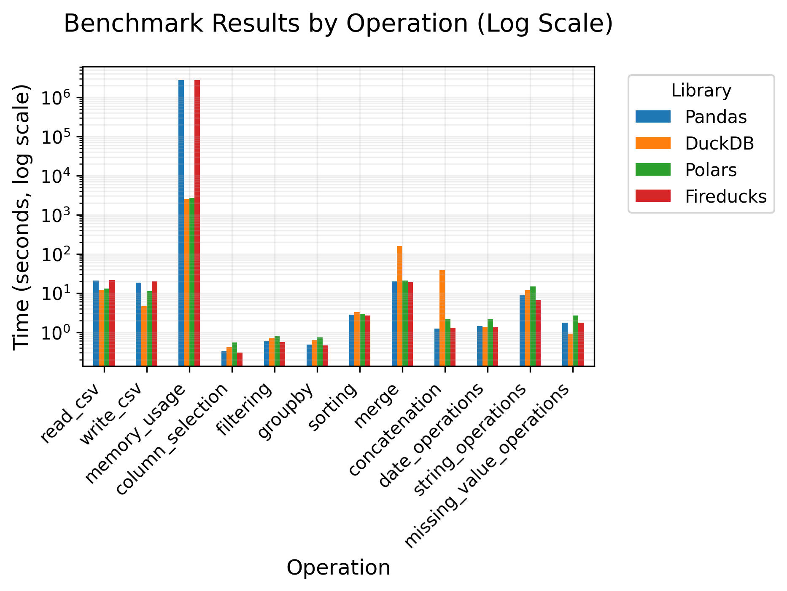

# Research Benchmark: Pandas vs Fireducks

This project benchmarks the performance of various data processing libraries (Pandas, DuckDB, Polars, and Fireducks) on common data operations.

## Setup

1. **Clone the repository**:
   ```bash
   git clone <repository-url>
   cd Research-Benchmark-Pandas-vs-Fireducks
   ```

2. **Install dependencies**:
   ```bash
   pip install -r requirements.txt
   ```

3. **Prepare your data**:
   - Place your CSV file (e.g., `fake_users.csv`) in the project root directory.

## Running the Benchmarks

Execute the benchmarks using the following command:

```bash
python -m benchmarks.run_benchmarks
```

### What Happens

- Each library's benchmarks are run **sequentially** in a separate process.
- Each library is run **10 times** to ensure reliable results.
- The results are averaged for each operation per library.
- Final results are plotted and saved in the `benchmark_results` directory.

## Results

The benchmark results are saved in the `benchmark_results` directory:

- **`benchmark_results.png`**: Bar plot of benchmark results (log scale).
- **`speedup_heatmap.png`**: Heatmap of speedup ratios compared to Pandas.
- **`raw_results.csv`**: Raw benchmark results.
- **`summary_table.csv`**: Summary table with formatted times.

## Benchmark Results and Conclusions

Based on the latest benchmark results (averaged over 10 runs), here are the key findings:



### 🏆 Overall Performance Winners

**Fireducks** emerges as the top performer in most operations:
- **Column Selection**: 1.07x faster than Pandas
- **Filtering**: 1.04x faster than Pandas  
- **Groupby**: 1.05x faster than Pandas
- **Sorting**: 1.06x faster than Pandas
- **Merge**: 1.05x faster than Pandas
- **String Operations**: 1.34x faster than Pandas

**DuckDB** excels in specific operations:
- **CSV Reading**: 1.70x faster than Pandas
- **CSV Writing**: 4.01x faster than Pandas
- **Missing Value Operations**: 1.90x faster than Pandas

### 📊 Detailed Analysis

1. **Data I/O Operations**:
   - **DuckDB** dominates CSV operations with 1.70x faster reading and 4.01x faster writing
   - **Fireducks** shows competitive performance but slightly slower than DuckDB for I/O

2. **Data Manipulation**:
   - **Fireducks** consistently outperforms in column selection, filtering, and groupby operations
   - **Polars** shows good performance but generally slower than Fireducks
   - **DuckDB** struggles with merge operations (7.95x slower than Pandas)

3. **Memory Usage**:
   - **DuckDB** shows the most efficient memory usage (1,123x less memory than Pandas)
   - **Polars** also demonstrates good memory efficiency
   - **Fireducks** and **Pandas** show similar memory usage patterns

4. **String and Date Operations**:
   - **Fireducks** leads in string operations (1.34x faster than Pandas)
   - **DuckDB** performs well in date operations (1.06x faster than Pandas)

### 🎯 Recommendations

- **For general data processing**: Use **Fireducks** for consistent performance across operations
- **For heavy I/O workloads**: Consider **DuckDB** for superior CSV reading/writing
- **For memory-constrained environments**: **DuckDB** offers the best memory efficiency
- **For string-heavy operations**: **Fireducks** provides the best performance

### ⚠️ Notable Limitations

- **DuckDB** shows significant performance degradation in merge operations (158s vs 20s for Pandas)
- **Polars** generally performs well but doesn't lead in any specific category
- **Fireducks** shows slightly slower CSV I/O compared to DuckDB

## Notes

- Each library runs in a fresh process to ensure a clean memory state.
- Memory usage is monitored and logged during execution.
- The default number of repeats is 10, but you can adjust `num_repeats` in `main()` if needed.

## License

This project is licensed under the MIT License - see the LICENSE file for details.

